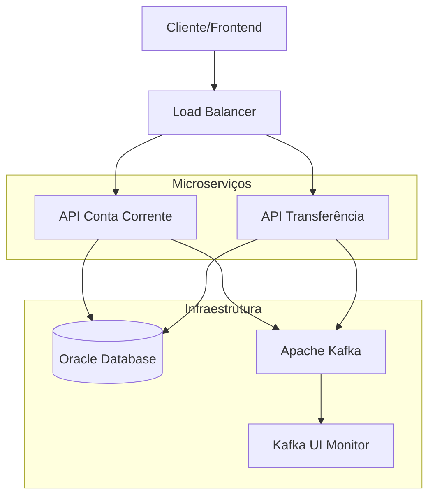

# 🏦 Banco Digital - Sistema de Contas Correntes e Transferências

[](https://dotnet.microsoft.com/)
[](https://docs.microsoft.com/en-us/dotnet/csharp/)
[](https://www.docker.com/)
[](https://www.oracle.com/database/)
[](https://kafka.apache.org/)
[](LICENSE)

> **Sistema bancário completo desenvolvido em .NET 8** com arquitetura de microserviços, implementando operações de conta corrente e transferências com alta performance, segurança e escalabilidade.

---

## 📋 Índice

- [🎯 Visão Geral](#-visão-geral)
- [🚀 Tecnologias](#-tecnologias)
- [🏗️ Arquitetura](#️-arquitetura)
- [📦 Microserviços](#-microserviços)
- [🔧 Funcionalidades](#-funcionalidades)
- [⚡ Instalação e Execução](#-instalação-e-execução)
- [📊 Monitoramento](#-monitoramento)
- [🔒 Segurança](#-segurança)
- [📚 Documentação da API](#-documentação-da-api)
- [🧪 Testes](#-testes)
- [🤝 Contribuindo](#-contribuindo)

---

## 🎯 Visão Geral

O **Banco Digital** é uma solução completa de sistema bancário que oferece:

- **Gestão de Contas Correntes**: Cadastro, autenticação e gerenciamento de contas
- **Sistema de Transferências**: Transferências seguras entre contas com controle de idempotência
- **Movimentações Financeiras**: Débitos e créditos com histórico completo
- **Arquitetura Escalável**: Microserviços independentes com comunicação assíncrona

### 🏆 Diferenciais Técnicos

- ✅ **Clean Architecture** com CQRS Pattern
- ✅ **Microserviços** desacoplados e escaláveis
- ✅ **Event-Driven Architecture** com Apache Kafka
- ✅ **Containerização** completa com Docker
- ✅ **Segurança JWT** com criptografia BCrypt
- ✅ **Banco Oracle** com Dapper ORM
- ✅ **Health Checks** e monitoramento
- ✅ **API Documentation** com Swagger/OpenAPI

---

## 🚀 Tecnologias

### **Backend & Framework**
-  **.NET 8.0** - Framework principal
-  **C# 11** - Linguagem de programação
-  **ASP.NET Core Web API** - Framework web

### **Arquitetura & Padrões**
- 🏗️ **Clean Architecture** - Organização de código
- 📨 **MediatR** (v12.2.0) - CQRS e Mediator Pattern
- 🔄 **CQRS** - Command Query Responsibility Segregation
- 📦 **DDD** - Domain Driven Design
- 🎯 **Repository Pattern** - Abstração de dados

### **Banco de Dados & ORM**
-  **Oracle Database 21c XE** - Banco principal
- 🔧 **Dapper** (v2.1.35) - Micro ORM para performance
- 🏠 **Oracle.ManagedDataAccess.Core** (v23.9.1) - Driver Oracle .NET

### **Mensageria & Eventos**
-  **Apache Kafka** (v7.4.0) - Message Broker
- 🔗 **Confluent Platform** - Ecossistema Kafka
- 🎛️ **Kafka UI** - Interface de gerenciamento

### **Segurança & Autenticação**
- 🔐 **JWT Bearer Authentication** - Autenticação stateless
- 🛡️ **BCrypt.Net-Next** (v4.0.3) - Hash de senhas
- 🔑 **System.IdentityModel.Tokens.Jwt** (v7.1.2) - JWT tokens
- 🚪 **Microsoft.AspNetCore.Authentication.JwtBearer** (v8.0.0)

### **DevOps & Containers**
-  **Docker & Docker Compose** - Containerização
- 🐳 **Multi-stage Dockerfile** - Otimização de imagens
- 🌐 **Docker Networks** - Comunicação entre containers
- 💾 **Docker Volumes** - Persistência de dados

### **Documentação & Testes**
-  **Swagger/OpenAPI** (v6.4.0) - Documentação automática
- 🩺 **Health Checks** - Monitoramento de saúde
- 📋 **API Testing** - Arquivo .http para testes

---

## 🏗️ Arquitetura

### **Visão Geral da Arquitetura**



### **Clean Architecture por Camada**

```
📂 Api_ContaCorrente/Api_Transferencia
├── 🎮 Controllers/          # Presentation Layer
├── 📋 Application/          # Application Layer
│   ├── Commands/           # Command handlers (Write)
│   ├── Queries/           # Query handlers (Read)
│   ├── Handlers/          # MediatR handlers
│   └── DTOs/              # Data Transfer Objects
├── 🏢 Domain/              # Domain Layer
│   ├── Entities/          # Domain entities
│   ├── ValueObjects/      # Value objects
│   ├── Repositories/      # Repository interfaces
│   └── Services/          # Domain services
└── 🔧 Infrastructure/      # Infrastructure Layer
    ├── Data/              # Database configuration
    ├── Repositories/      # Repository implementations
    └── Services/          # External services
```

---

## 📦 Microserviços

### **🏦 API Conta Corrente** (Porta: 5222)

**Responsabilidades:**
- ✅ Cadastro e gestão de contas correntes
- ✅ Autenticação e autorização JWT
- ✅ Movimentações (débito/crédito)
- ✅ Consulta de saldo e extrato
- ✅ Ativação/inativação de contas

**Endpoints Principais:**
```http
POST   /api/conta/cadastrar     # Cadastrar nova conta
POST   /api/conta/login         # Autenticar usuário
GET    /api/conta/{id}          # Consultar conta
PUT    /api/conta/inativar/{id} # Inativar conta

POST   /api/movimento/movimentar    # Realizar movimentação
GET    /api/movimento/saldo/{id}    # Consultar saldo
GET    /api/movimento/extrato/{id}  # Consultar extrato
```

### **💸 API Transferência** (Porta: 5037)

**Responsabilidades:**
- ✅ Transferências entre contas
- ✅ Controle de idempotência
- ✅ Validação de contas
- ✅ Histórico de transferências
- ✅ Integração com API Conta Corrente

**Endpoints Principais:**
```http
POST   /api/transferencia/transferir        # Realizar transferência
GET    /api/transferencia/historico        # Consultar histórico
GET    /api/transferencia/{id}             # Detalhes da transferência
```

---

## 🔧 Funcionalidades

### **👤 Gestão de Contas**
- 📝 **Cadastro de conta** com validação de CPF
- 🔑 **Login seguro** com JWT tokens
- 👁️ **Consulta de dados** da conta
- ❌ **Inativação** de contas

### **💰 Movimentações Financeiras**
- ♻️ **Débitos e créditos** em tempo real
- 📊 **Consulta de saldo** instantânea
- 📄 **Extrato detalhado** com filtros por período
- 🔄 **Histórico completo** de transações

### **🔄 Transferências**
- 💸 **Transferências entre contas** da mesma instituição
- 🛡️ **Controle de idempotência** para evitar duplicações
- ✅ **Validação automática** de contas origem e destino
- 📋 **Histórico completo** de transferências
- 🔒 **Autorização JWT** obrigatória

### **🔒 Segurança**
- 🔐 **Autenticação JWT** com refresh tokens
- 🛡️ **Criptografia BCrypt** para senhas
- 🚪 **Autorização por endpoints** protegidos
- 🔍 **Validação rigorosa** de dados de entrada

---

## ⚡ Instalação e Execução

### **Pré-requisitos**
- 🐳 [Docker Desktop](https://www.docker.com/products/docker-desktop)
- 🐳 [Docker Compose](https://docs.docker.com/compose/)
- ⚡ [.NET 8 SDK](https://dotnet.microsoft.com/download) (opcional para desenvolvimento)

### **🚀 Execução com Docker (Recomendado)**

1. **Clone o repositório:**
```bash
git clone https://github.com/xthiagoteixeira/CSharp.git
cd CSharp/Desafio-BancoDigital
```

2. **Execute o ambiente completo:**
```bash
# Windows (PowerShell)
.\docker-manage.ps1 up

# Linux/Mac
./docker-manage.sh up
```

3. **Aguarde a inicialização completa** (aproximadamente 2-3 minutos)

4. **Verifique os serviços:**
```bash
docker-compose ps
```

### **🔧 Execução Manual (Desenvolvimento)**

1. **Configure o Oracle Database:**
```bash
docker run -d --name oracle-banco-digital \
  -p 1521:1521 -p 5500:5500 \
  -e ORACLE_PWD=BancoDigital123 \
  container-registry.oracle.com/database/express:21.3.0-xe
```

2. **Configure o Kafka:**
```bash
docker-compose up -d zookeeper kafka kafka-ui
```

3. **Execute as APIs:**
```bash
# API Conta Corrente
cd Api_ContaCorrente
dotnet run --urls="http://localhost:5222"

# API Transferência (novo terminal)
cd Api_Transferencia
dotnet run --urls="http://localhost:5037"
```

### **🌍 URLs de Acesso**

| Serviço | URL | Descrição |
|---------|-----|-----------|
| 🏦 **API Conta Corrente** | http://localhost:5222 | Gestão de contas e movimentações |
| 💸 **API Transferência** | http://localhost:5037 | Sistema de transferências |
| 📚 **Swagger Conta Corrente** | http://localhost:5222/swagger | Documentação API Conta |
| 📚 **Swagger Transferência** | http://localhost:5037/swagger | Documentação API Transferência |
| 🎛️ **Kafka UI** | http://localhost:8090 | Interface do Kafka |
| 🔍 **Oracle EM Express** | http://localhost:5500/em | Oracle Enterprise Manager |

---

## 📊 Monitoramento

### **🩺 Health Checks**

Todos os serviços possuem endpoints de saúde:

```bash
# API Conta Corrente
curl http://localhost:5222/health

# API Transferência  
curl http://localhost:5037/health

# Resposta exemplo:
{
  "status": "healthy",
  "timestamp": "2024-01-15T10:30:00Z"
}
```

### **📈 Métricas e Logs**

- **Container Logs:**
```bash
# Logs em tempo real
docker-compose logs -f api-conta-corrente
docker-compose logs -f api-transferencia

# Logs específicos
docker logs oracle-banco-digital
docker logs kafka-banco-digital
```

- **Kafka Monitoring:**
  - Acesse http://localhost:8090 para visualizar tópicos, mensagens e consumers

### **🔍 Troubleshooting**

```bash
# Verificar status dos containers
docker-compose ps

# Reiniciar serviços específicos
docker-compose restart api-conta-corrente

# Verificar conectividade com banco
docker exec -it oracle-banco-digital sqlplus system/BancoDigital123@localhost:1521/XE
```

---

## 🔒 Segurança

### **🔐 Autenticação JWT**

O sistema utiliza **JWT (JSON Web Tokens)** para autenticação stateless:

```json
{
  "iss": "Api_ContaCorrente",
  "aud": "Api_ContaCorrente_Users", 
  "exp": 1640995200,
  "sub": "12345",
  "contaId": "67890"
}
```

**Configuração:**
- 🔑 **Algoritmo:** HS256
- ⏰ **Expiração:** 60 minutos (configurável)
- 🛡️ **Secret Key:** 256-bit configurável via environment

### **🛡️ Proteção de Senhas**

- **BCrypt** com salt rounds configurável
- **Validação de força** de senha
- **Hash irreversível** armazenado no banco

### **🚪 Autorização**

- **Endpoints protegidos** com `[Authorize]`
- **Claims personalizadas** no JWT
- **Validação de permissões** por conta

---

## 📚 Documentação da API

### **📖 Swagger/OpenAPI**

Ambas as APIs possuem documentação interativa completa:

- **API Conta Corrente:** http://localhost:5222/swagger
- **API Transferência:** http://localhost:5037/swagger

### **🧪 Exemplos de Uso**

#### **1. Cadastrar Conta**
```http
POST http://localhost:5222/api/conta/cadastrar
Content-Type: application/json

{
  "nome": "João Silva",
  "cpf": "12345678901",
  "senha": "MinhaSenh@123"
}
```

#### **2. Fazer Login**
```http
POST http://localhost:5222/api/conta/login
Content-Type: application/json

{
  "cpf": "12345678901",
  "senha": "MinhaSenh@123"
}
```

#### **3. Realizar Transferência**
```http
POST http://localhost:5037/api/transferencia/transferir
Authorization: Bearer {seu-jwt-token}
Content-Type: application/json

{
  "contaOrigemId": 1,
  "contaDestinoId": 2,
  "valor": 100.50,
  "descricao": "Transferência PIX",
  "chaveIdempotencia": "unique-key-123"
}
```

### **📋 Arquivo de Testes**

Use os arquivos `.http` incluídos no projeto:
- `Api_ContaCorrente/requests.http`
- `Api_Transferencia/Api_Transferencia.http`

---

## 🧪 Testes

### **🔧 Testes Manuais**

```bash
# Executar com arquivos .http
# Use VS Code com extensão REST Client
# Ou use curl/Postman com os exemplos fornecidos
```

### **🚀 Testes de Carga**

```bash
# Teste de performance básico
for i in {1..100}; do
  curl -X GET http://localhost:5222/health &
done
wait
```

### **✅ Cenários de Teste**

1. **Teste de Conta:**
   - ✅ Cadastro com CPF válido
   - ❌ Cadastro com CPF inválido
   - ✅ Login com credenciais corretas
   - ❌ Login com credenciais incorretas

2. **Teste de Transferência:**
   - ✅ Transferência com saldo suficiente
   - ❌ Transferência com saldo insuficiente
   - ✅ Controle de idempotência
   - ❌ Transferência sem autorização

---

## 🤝 Contribuindo

### **🛠️ Setup de Desenvolvimento**

1. **Fork** o repositório
2. **Clone** seu fork localmente
3. **Configure** o ambiente de desenvolvimento:

```bash
# Instalar dependências
dotnet restore

# Configurar banco local
docker run -d --name oracle-dev -p 1521:1521 -e ORACLE_PWD=dev123 container-registry.oracle.com/database/express:21.3.0-xe

# Executar em modo desenvolvimento
dotnet run --environment Development
```

### **📝 Padrões de Código**

- **Clean Code** principles
- **SOLID** principles
- **Conventional Commits**
- **Entity Framework** naming conventions
- **Microsoft C#** coding standards

### **🔄 Processo de Contribuição**

1. 🍴 **Fork** o projeto
2. 🌿 **Crie** uma branch feature (`git checkout -b feature/AmazingFeature`)
3. 💾 **Commit** suas mudanças (`git commit -m 'Add some AmazingFeature'`)
4. 📤 **Push** para a branch (`git push origin feature/AmazingFeature`)
5. 🔃 **Abra** um Pull Request

---

## 📄 Licença

Este projeto está licenciado sob a **MIT License** - veja o arquivo [LICENSE](LICENSE) para detalhes.

---

## 👨‍💻 Autor

**Desenvolvido com 💜 para demonstrar expertise em:**

- 🏗️ **Arquitetura de Software** moderna e escalável
- 🚀 **Microserviços** com .NET 8
- 🔒 **Segurança** robusta em aplicações financeiras
- 🐳 **DevOps** com containerização completa
- 📊 **Performance** e otimização de sistemas

---

[](https://linkedin.com/in/xthiagoteixeira)

</div>
